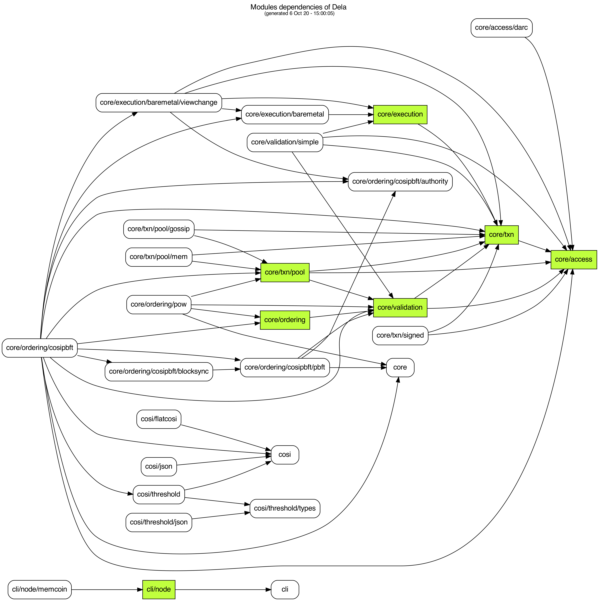

# Architecture

Dela has been built with modularization and testability in mind. As such, the
system is made of multiple interoperable modules based on a set of well-defined
abstractions.

## Stacks

The stacks display the role of each module and its relation to others. Each
module can rely on zero or more of the modules below it. From the client's
perspective the stack is simpler since it doesn't need to know about the complex
ordering mechanism.

## Execution flow

The execution flow displays how the system uses the modules in order to fulfill
its goals. Since a client and a node have different goals, we display the
perspective from those two separately.

## CoSiPBFT flow

CoSiPBFT is the actual implementation of the ordering module. This is the core
part that orchestrates the addition of new blocks based on Collective
Signatures. This diagrams helps to understand how the leader and its followers
work together to verify and include new blocks.

## Package dependencies

Here is a simplified diagram of package dependencies, for reference:

