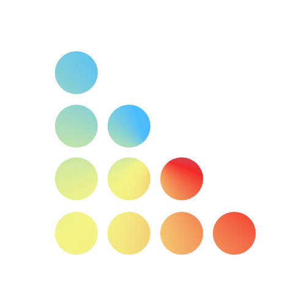

# Dela

> Dedis Ledger Architecture

    
    
    
    

- A set of modular abstractions to perform Distributed Ledger (DL) operations
- Provides an implementation of a minimalist DL
- Demonstrates a full working DL implementation based on [Collective Signing](https://www.usenix.org/system/files/conference/usenixsecurity16/sec16_paper_kokoris-kogias.pdf)
- Offers a platform that supports research in Distributed Ledger Technologies (DLT)
