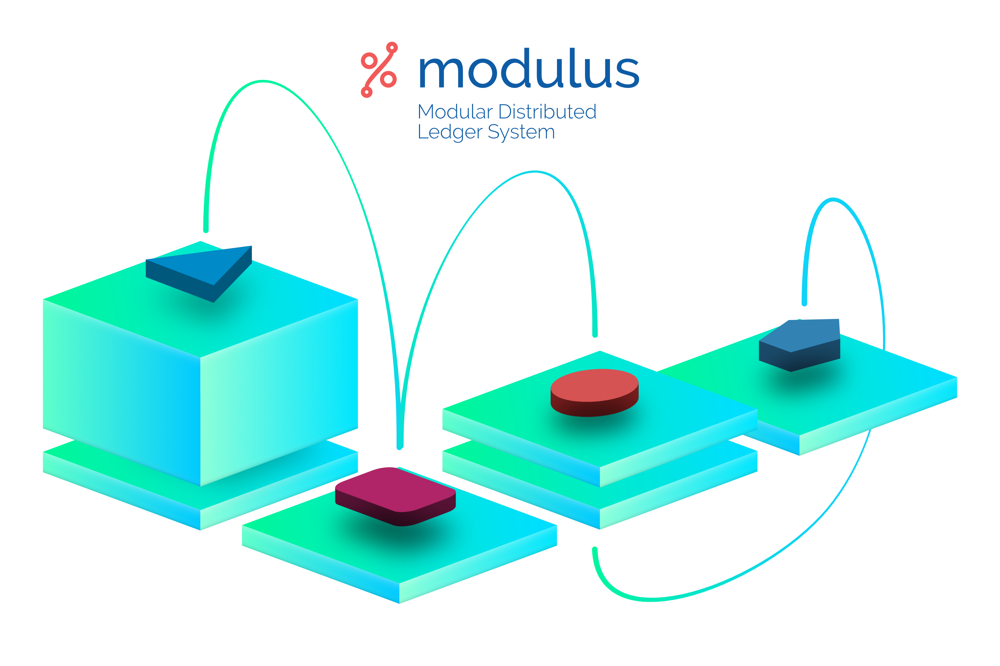
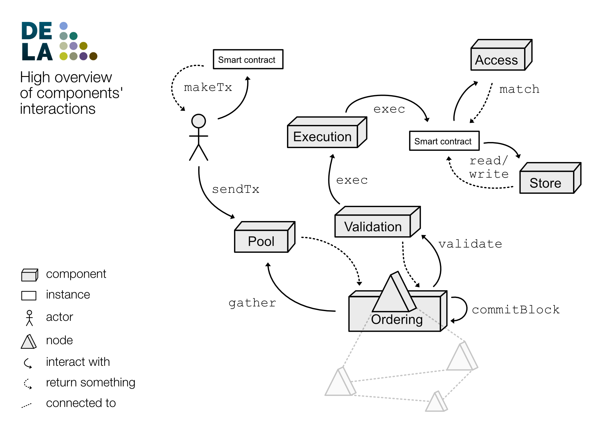

# Dela

Dela stands for DEDIS Ledger Architecture. It is both a set of abstractions and
an implementation of a distributed ledger architecture.

Dela has 2 main purposes:

- Provide a modular, global-purpose, and universal framework that describes a
  minimal and extended set of abstractions for a distributed ledger
  architecture.
- Provide multiple modules implementations that can be combined to run a
  distributed ledger.

With Dela you can:

- Learn the architecture of a distributed ledger
- Run your blockchain / distributed ledger
- Implement and test your new idea that will revolutionize the blockchain world
  by adding your new module's implementation to the Dela ecosystem

## Distributed ledger

A distributed ledger aims to solve the following problem: how can a set of
entities agree on a state without any central entity? In other words: how can a
group of computers (or *nodes*) cooperate to maintain a database? This problem
is not new and has been solved with, for example, distributed databases. With
distributed databases, multiple replicas of a database are kept in different
locations and constantly maintained to have the same view on the data. If a
replica fails or stops responding, another copy is ready to take the relay.
Distributed ledgers are not that different from distributed databases except
with one major point: parties - or *nodes* - don't trust each other. Where a
distributed database can use a set of trusted *cooperative* nodes, a distributed
ledger is rather a set of untrusted *foreigners* entities that must find a way
to agree on a state. Distributed databases can be compared to a set of friends
that keep collectively the amounts that everybody owes to each other, while a
distributed ledger would be doing the same but with everyone in your city (do
you trust everyone in your city to tell you how much you owe to your friend?).

A notorious application of a distributed ledger is Bitcoin, which uses a
blockchain data structure and a mining protocol (*Proof-of-Work*) to maintain a
consistent and decentralized list of coin transactions. This global list of
transactions (or *ledger*) is what allows the existence of a such decentralized
crypto-currency.

## Architecture

Dela has 6 core modules that you will find in `core/`:

- access
- execution
- ordering
- store
- txn (and its sub-module txn/pool)
- validation

The following diagram simplifies a lot the system to offer a general and
informal overview of the components' interactions, from both the client's side
and the node's side:

More documentations and diagrams can be found in [architecture](architecture.md).

## Terminologies

- **actor** - An actor is a player of a protocol or a module. It is intended to
  be accessible only after the initialization and it provides the primitives to
  start the underlying protocol logic.

- **arc** - Arc stands for Access Rights Control. It is the abstraction that
  controls the access to the instances.

- **blockchain** - A blockchain is a distributed and immutable storage
  abstraction. A well-defined threshold of participants work together to reach a
  consensus on every block.

- **cosi** - CoSi stands for *Collective Signature*. It represents an aggregate
  of signature from multiple key pairs and it can be verified by the
  corresponding aggregate of public keys.

- **fingerprint** - Fingerprint defines a digest commonly produced by a hash
  algorithm that can be used to verify the integrity of some data. One example
  is the inventory page integrity to prove which instances are stored.

- **governance** - Governance is a black box that gives the ability to act on
  the participants of a consensus.

- **instance** - An instance is the smallest unit of storage in a ledger. It is
  identified by a unique key and stores a generic piece of data.

- **inventory** - An inventory is the storage abstraction of a ledger. The
  ledger evolves alongside with the blocks and that is represented by pages in
  an inventory where the index matches the block index.

- **ledger** - A ledger is a book of records of transactions. Similarly, a
  public distributed ledger can be implemented on top of a blockchain.

- **message** - A message is a serialized data structure that can be transmitted
  over a physical channel and decoded on the other side.

- **mino** - Mino stands for *Minimalist Network Overlay*, it is the abstraction
  that defines how to register and use RPCs over a distributed set of nodes.

- **node** - A node is a server participating in a protocol.

- **payload** - A payload is the data that a block will store. The blockchain
  implementation does not know the data structure thus requires a
  *PayloadProcessor* that will validate during the consensus.

- **proof** - A proof is a cryptographic tool that can provide integrity to a
  piece of data.

- **protobuf** - https://developers.google.com/protocol-buffers/

- **roster** - A roster is a set of participants to a protocol.

- **RPC** - RPC stands for *Remote Procedure Call*. It represents a procedure
  that an authorized external actor can call to get a specific result.

- **skipchain** - A skipchain is a specific implementation of the blockchain
  that is using collective signings to create shortcuts between blocks.

- **task** - A task is an order of execution that is stored inside a
  transaction. It will define how the transaction will update the inventory.
