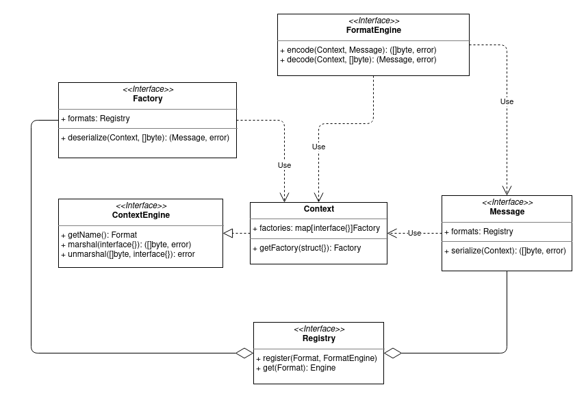

# Serde

Serde is a serialization/deserialization abstraction. It has the purpose to
provide a simple API to serialize or deserialize messages without the concern of
the format, which is configurable.

A format like JSON is composed of message format engines that will implement the
logic of serialization/deserialization. They can be registered depending on the
choice on the formats available.



## Context

Each format is expected to have a context engine implementation that will be
used to populate a Serde context. This context provides the format name
alongside the _marshal_ and _unmarshal_ API common to most of the encoding
implementations.

The context can also store factories so that embedded messages can be
deserialized. Similarly to `golang.org/pkg/context`, the factories are only
populated for a given deserialization and thus to a specific context.

A context API looks like:

```go
type Context interface {
    GetFormat() Format
    
    GetFactory(key interface{}) Factory

	Marshal(message interface{}) ([]byte, error)

	Unmarshal(data []byte, message interface{}) error
}
```

A factory can be provided to a deserialization context through:

```go
type key struct{}

type factory struct {
    Factory
}

nextCtx := WithFactory(ctx, key{}, factory{})

fac := nextCtx.GetFactory(key{}) // fac == factory{}
```

## Format

A format engine will implement two functions:

```go
type FormatEngine interface {
	Encode(ctx Context, message Message) ([]byte, error)

	Decode(ctx Context, data []byte) (Message, error)
}
```

_Encode_ is responsible for serialiazing the message into bytes. It is the
responsability of the implementation to accept one or several types of messages
for a given engine.

_Decode_ is responsible for deserializing data into a message. Similarly to
_Encode_, it can return one or several types of messages.

The following snippet is an example of an engine for two types of messages using
the JSON format. The way to differenriate several messages will greatly vary
with the format used and if the format is self-describing or not.

```go
package json

type RequestJSON struct {
    ...
}

type ResponseJSON struct {
    ...
}

type MessageJSON struct {
    Request  *RequestJSON
    Response *ResponseJSON
}

type engine struct{}

func (engine) Encode(ctx serde.Context, message Message) ([]byte, error) {
    var m Message
    
    switch in := msg.(type) {
    case types.Request:
        m = MessageJSON{Request: &RequestJSON{...}}
    case types.Response:
        m = MessageJSON{Response: &ResponseJSON{...}}
    default:
        return nil, errors.New("invalid message")
    }

    data, err := ctx.Marshal(m)
    if err != nil {
        return nil, err
    }

    return data, nil
}

func (engine) Decode(ctx serde.Context, data []byte) (Message, error) {
    m := MessageJSON{}
    err := ctx.Unmarshal(data, &m)
    if err != nil {
        return nil, err
    }

    if m.Request != nil {
        return types.NewRequest(...), nil
    }

    if m.Response != nil {
        return types.NewResponse(...), nil
    }

    return nil, errors.New("empty message")
}
```

## Message and Factory

A message will implement the serialization and a factory will implement the
deserialization. It is left to the implementation to support one or several
formats but serde provides a registry to simplify the registration:

```go
package types

var requestFormats = registry.NewSimpleRegistry()

type Request struct {
    ...
}

func (req Request) Serialize(ctx serde.Context) ([]byte, error) {
    format := requestFormats.Get(ctx.GetName())
    // This registry always returns a format which can be an empty one.

    data, err := format.Encode(ctx, req)
    if err != nil {
        return nil, err
    }

    return data, nil
}
```

Doing so will allow anyone to implement its own format and register it. A given
format could be overriden if necessary to use a different implementation but the
developer needs to make sure the registration will be done after the standard
one if it is imported as shown below. *Note*: it is not necessary to import for
new format.

```go
import "go.dedis.ch/dela/serde/json"

requestFormats.Register(serde.FormatJSON, myEngineImpl{})
```

A factory can also be implemented to prepare the context of the deserialization:

```go
type Factory struct{}

func (f Factory) Deserialize(ctx serde.Context, data []byte) (Message, error) {
    format := requestFormats.Get(ctx.GetName())

    // Populate the context with factories of embedded messages if necessary.
    // ctx = WithFactory(ctx, ...)

    msg, err := format.Decode(ctx, data)
    if err != nil {
        return nil, err
    }

    return msg, nil
}
```
